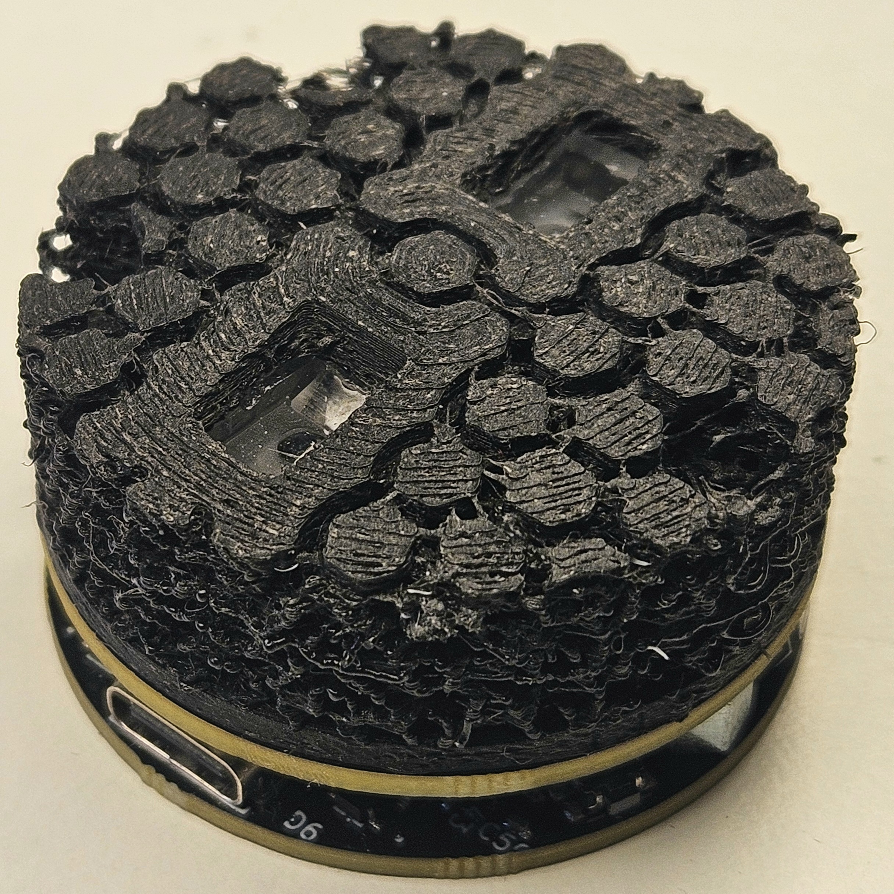
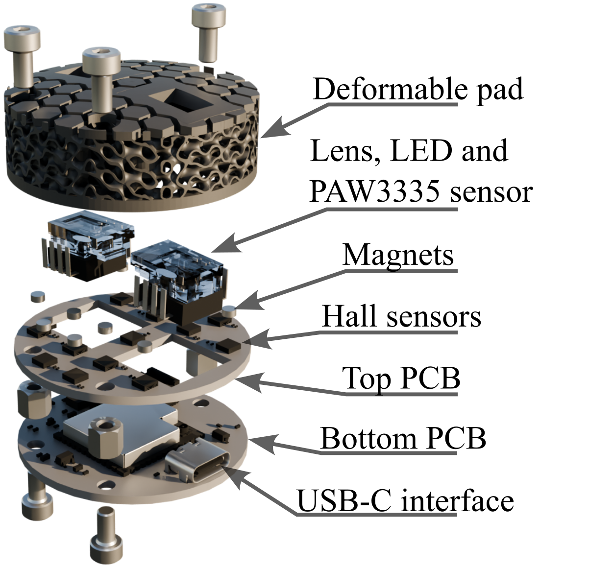
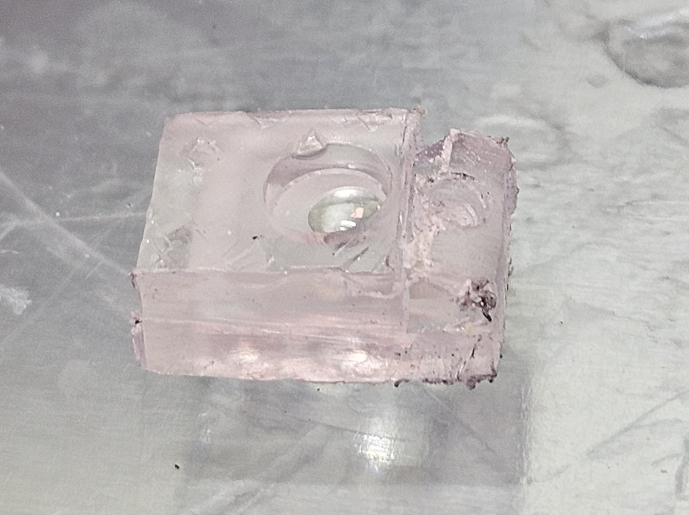
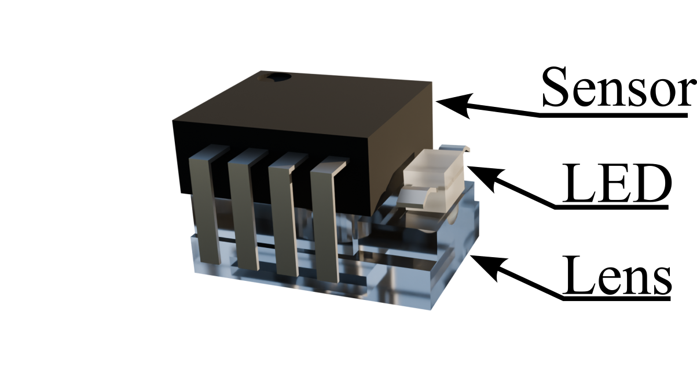
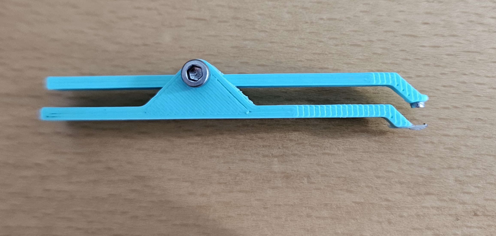
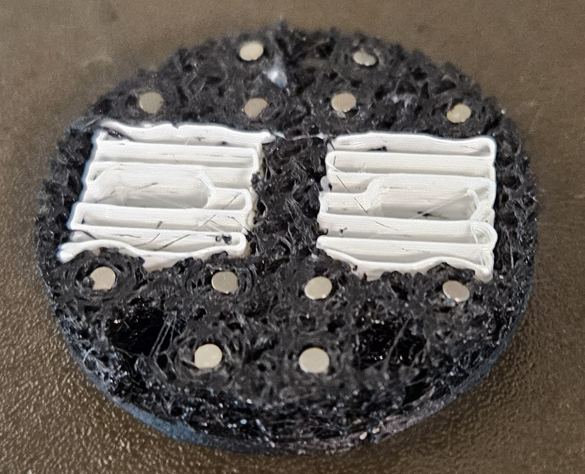
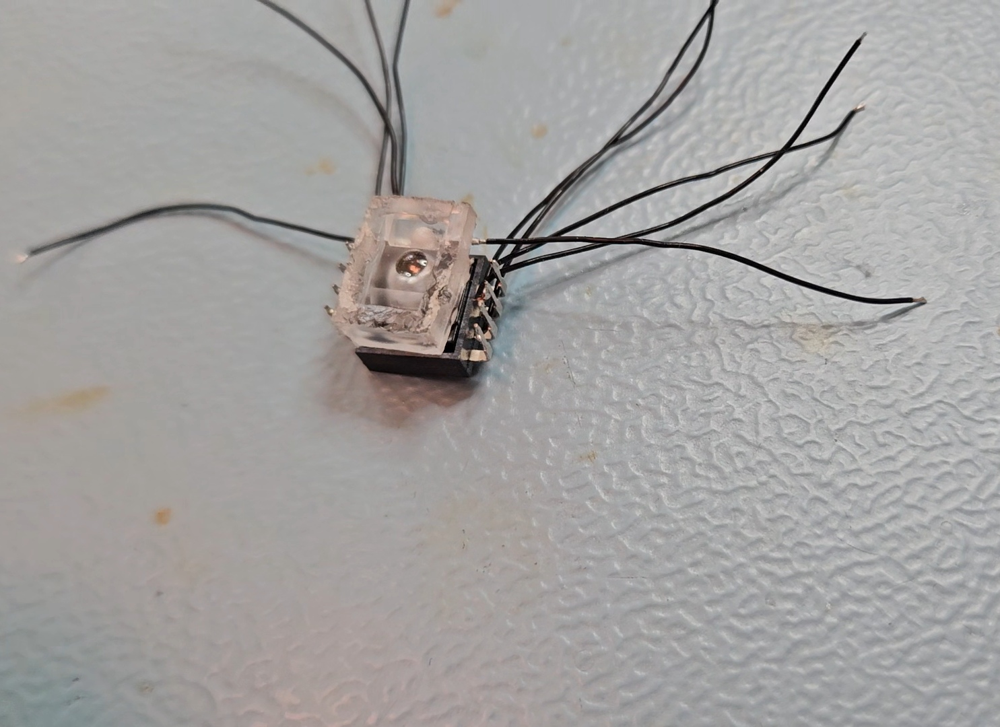
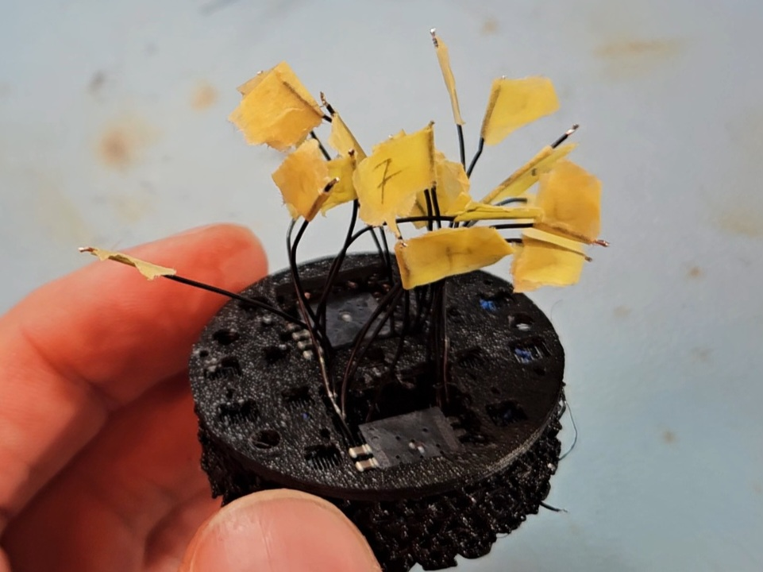
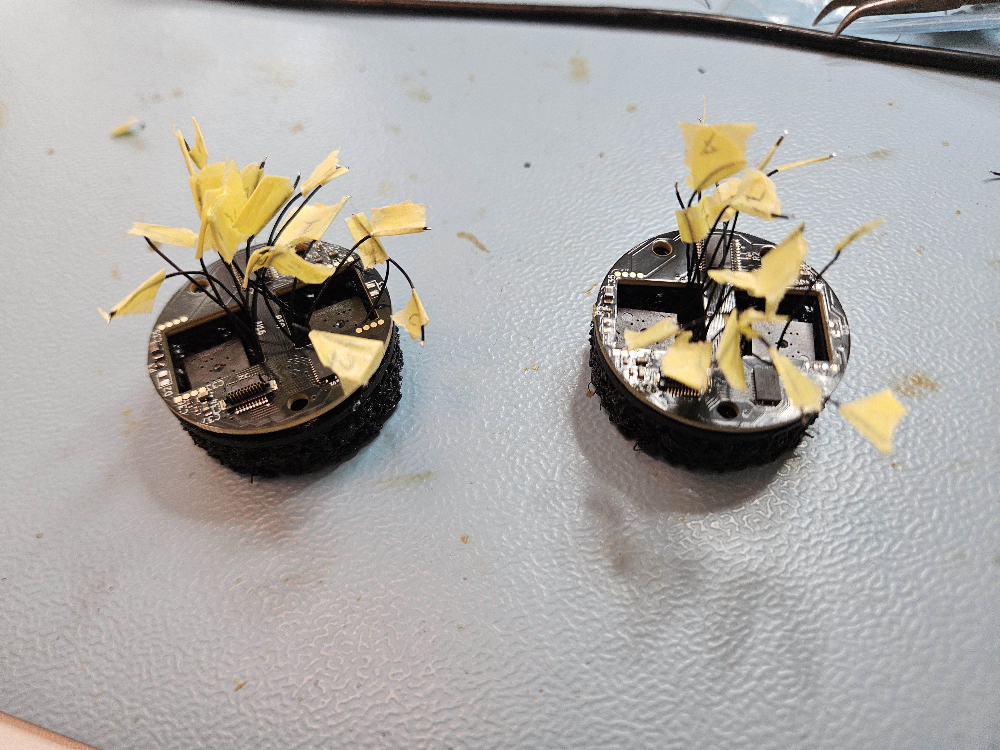
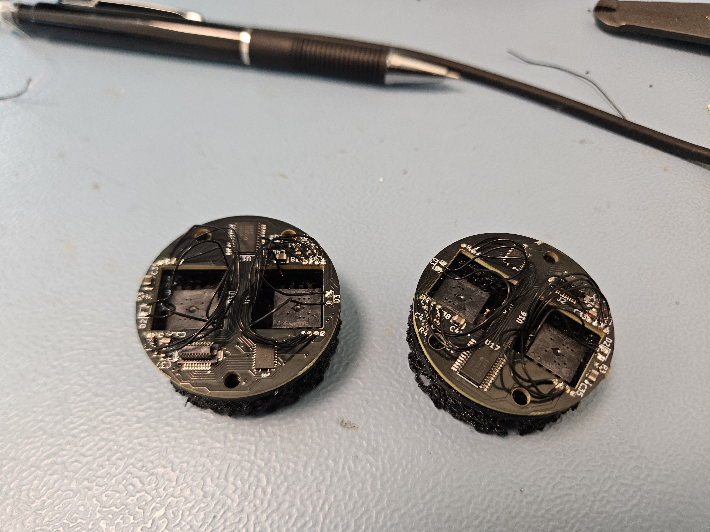

# Sensor build guide

This is a guide for how to build the sensors. This guide is aimed at people who know how to use tools such as 3D printers, soldering equipment, and basic embedded electronics. This guide is written to a reasonable level of detail, but it is expected that whoever follows it can fill in the gaps.

## PCB

There are two PCB boards that need to be manufactured. I manufactured them as one board, where they could be broken off from each other. The PCB is manufactured as a 4-layer, double-sided board, with machine assembly. It is not designed for manual assembly, except for attaching the optical sensors, which have to be soldered manually. I used PCBWay to manufacture them; other similar services should also work. Under the PCB subfolder, you will find the files necessary for manufacturing and the BOM. The source KiCad files are also provided.

## Optical sensor unit

Each optical sensor unit consists of the lens, sensor, and LED. The sensor and lens are from the PAW3335DB-TZDU kit. The lens has to be manually cut to a smaller size, as shown in the figure below.

As can be seen, there is also a small hole drilled where the LED will be placed. The hole is approximately 2 mm deep, just enough to fit the dome of the LED cap. The sensor and LED are then glued to the lens with super glue. Make sure that no glue gets close to the optical hole of the sensor. The final result should resemble the illustration below.

## Printing of contact pad

The contact pad is printed in TPU85 material with 100% infill and PLA as support material. It was printed on a printer that supports multiple printing nozzles (Prusa XL with 5 tool heads). The print is then paused (this can be programmed in PrusaSlicer) when the slots for the magnets are exposed. Twelve N35 magnets, 1 mm thick and 2 mm in diameter, are placed in the slots with a bit of super glue to keep them from jumping out. I put a drop of glue on the side, then dipped the magnet in the drop and placed it into the slot. For this, I printed a tool, essentially a thing with a magnet on it that can open (magnet is glued to top part), to help pick up and place the magnets (see the supporting_files folder). 

After the magnets have been placed, you should have something like the image below.

After this, the 3D print can continue until it is completed. The PLA support is then removed, leaving you with the contact pad containing 12 magnets.

## Wiring

Wiring the optical sensors to the top PCB board is probably the most tedious task. We begin by wiring the cables to each of the optical sensor modules, as shown in the figure below.

It is very important that the correct type of wire is used. It needs to be thin and have a high strand count. If either of these requirements is not met, the cable will either break during repeated bending or it will not be flexible enough to assemble. I use 30 AWG, 49-strand wire. Also, be careful not to damage the sensor during soldering.

Then, I mark all the cables and place them in the contact pad, as shown below. I add a bit of glue to make sure the sensor won't fall out during operation.

Then the top PCB can be placed.

Finally, solder all the cables. Be careful to solder them correctly, as it is a bit confusing. I used a laptop with KiCad and the datasheets open to find the correct pin matching. Just remember that you are viewing the design from the opposite direction in KiCad. The end result should look something like this:

## Assembly

The final assembly is very simple. You will need three M3 spacers, 5 mm, ([Würth Elektronik 970050366](https://www.mouser.se/en/ProductDetail/Wurth-Elektronik/970050366?qs=wr8lucFkNMUPheOXmFZsfA%3D%3D)) spacers and six M3 screws. I think the top M3 screws are 6 mm long, and the length of the bottom screws will depend on what the assembly will be mounted on. The important thing is that the M3 screws can both fit into the spacers.

And you have your final assembly:

