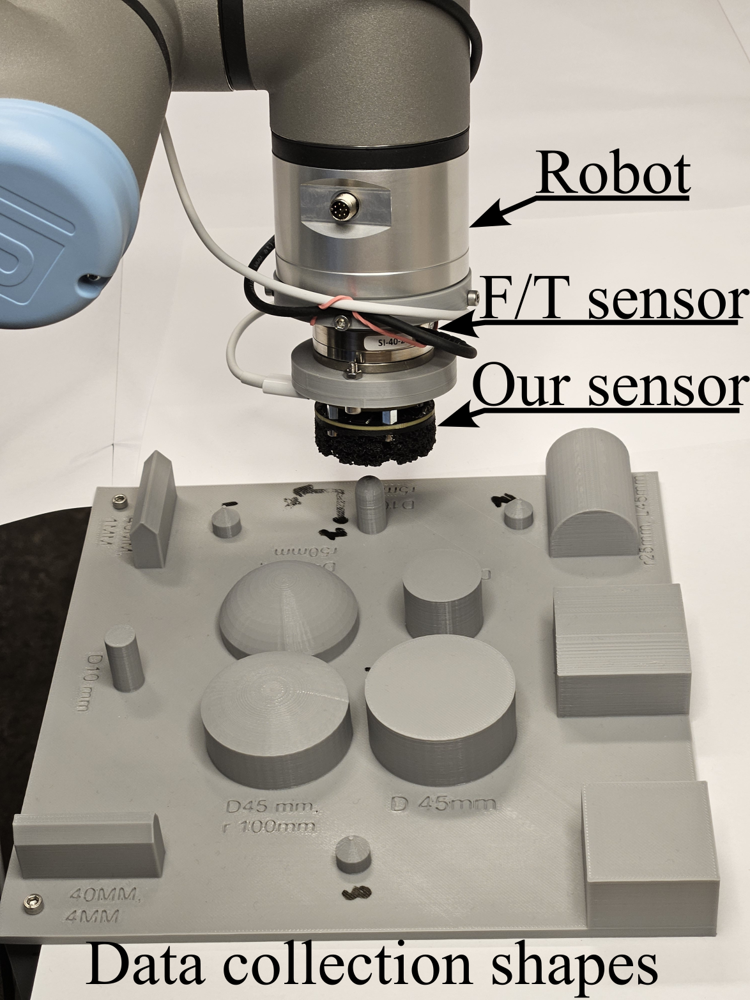
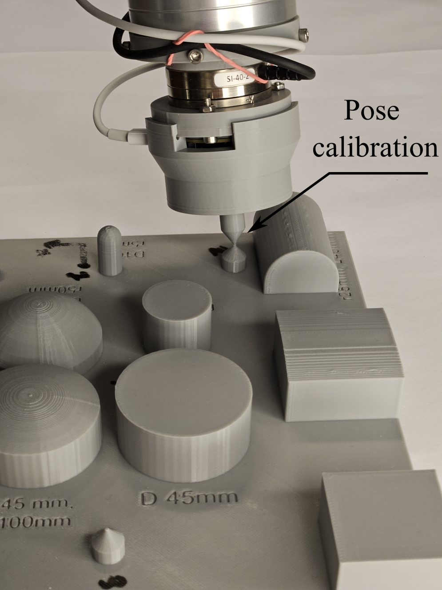

# Code on PC side

This is the part of the project that is the most messy. It is based on ROS Noetic, which is beyond outdated at this point. But the core part of the code for running the sensors has no real dependence on ROS Noetic and can be easily ported to run with anything that suports USB serial and torch. We have already ported it to another framework which is not based on ROS, but not sure when that will see the light of day (not up to me). If I where to use this, I would probaly rewrite this to ROS2 or what ever your lab is using. I never bothered to update, because it worked and it is the very end of my PhD.   

There are a lot of places in the code where you will need to provide paths to models or bags etc... 

## Interfacing with the sensors

Under "/src/sensor_run_time" there is two sets of code to run the sensors. This I included the code that runs a sensor individually and the code that allows multiple of them to run on for example a gripper (https://github.com/Gabrieleenx/Slip-Aware-Object-Manipulation-with-Parallel-Grippers). 


To run the sensors indiviually you have 
```
rosrun sensor_v2 tactile_sensor_node.py
```
which starts the serial communciation with the sensor.
Then the sensor data is mapped to forces and pressure map with:
```
rosrun sensor_v2 tacitle_mapping_node.py
```

For when I ran it on the gripper I used
```
rosrun sensor_v2 sensors_on_gripper.py
```
this also includes the cross sensor compensation. And mapping:
```
rosrun sensor_v2 sensors_mapping_on_gripper.py
```

## Collecting traning data and training 

First don't blindly follow others code when controlling robots, that includes this code. This code does not have many saftey features so don't trust it! It worked for me, but doesn't mean it will work for you. It is essentially just inverse differential kinematics and some trajectory following with force limits/feedback, I would encurage you to write your own version, it is not many lines of code for controlling a UR3e robot. 

This is to collect the data for training, the setup should look like the figure below:

tactile_gym

All 3D printed files are in the bild_files folder. To start the data collection process, there is like robotics classic of 15 scripts to run in terminals. 

```
rosrun rviz rviz -d ~/Documents/Catkin_workspace/catkin_yumi/src/ur_description/launch/ur3_rviz.launch
roslaunch ur_robot_driver ur3e_bringup.launch robot_ip:=192.168.56.3 kinematics_config:=$(rospack find sensor_v2)/etc/robot_calibration.yaml
rosparam load ~/Documents/Catkin_workspace/catkin_yumi/src/sensor_v2/config/ur3_joint_velocity_controller.yaml
rosrun controller_manager spawner --stopped ur3_joint_velocity_controller
rosservice call /controller_manager/switch_controller "{start_controllers: ['ur3_joint_velocity_controller'], stop_controllers: ['scaled_pos_joint_traj_controller'], strictness: 2}"
rosrun netft_utils netft_node --address=192.168.56.5 --sensor_nr=1 # modify to what ever F/T sensors you use, also rezero it!
rosrun sensor_v2 cartesian_velocity_converter_node
roslaunch sensor_v2 tactile_controller.launch 

```

```
rosrun sensor_v2 tactile_sensor_node.py
rosrun sensor_v2 tactile_tf_direct.py
rosrun sensor_v2 calibrate_sensor.py
```
This will ask you to first calibrate the pose, like so:



which shows the second calibration pose, 1st is down and 3rd is closest to the camera. This is lead through with the F/T sensor. This will take like 1 hour once started. 

Then do the same to collect the validation data (with fewer pokes).

Once you have two folders with a bunch of bag fiels, we need to extract data and calculate the mesh overlap. This is very so and ineffeicently implemented, so would recomend to do over night. Go to "/data_creation/" and run filter_data.py, and make sure it is pointing to the correct folder with all the data. This will create a data.csv in the folder with the data, do this for both traning and validation foler. 

Then run "filter_out_bad_data.py", it removes some samples that have overlap with no force or the opposie, mby like 30 datapoints in 1900 ish.

We then have the data sets ready for traning a mapping. Under "/learn_mapping/" there is a file called train_mapping.py, point to the training and validation csv files and run the script.

## Calibrate optical sensors

In the mapping scripts there is a sensor config class with the paramters for each optical sensor. These can be found by running calibrate_vel_sensor.py instead of calibrate_sensor.py above. Replace the bag files in "estimate_sensor_pose/data/" with those and run "calculate_sensor_pose.py", this will print out the parameter for each optical sensor. 

I know this is a bit of a messy project and requiers a bit more effort than just run it. But this field of sliding in-hand manipulation is very small and I would not expect many to care to replicate the setup. If that turn out to be wrong, and there is a big interest, then I might try to improve the library.  